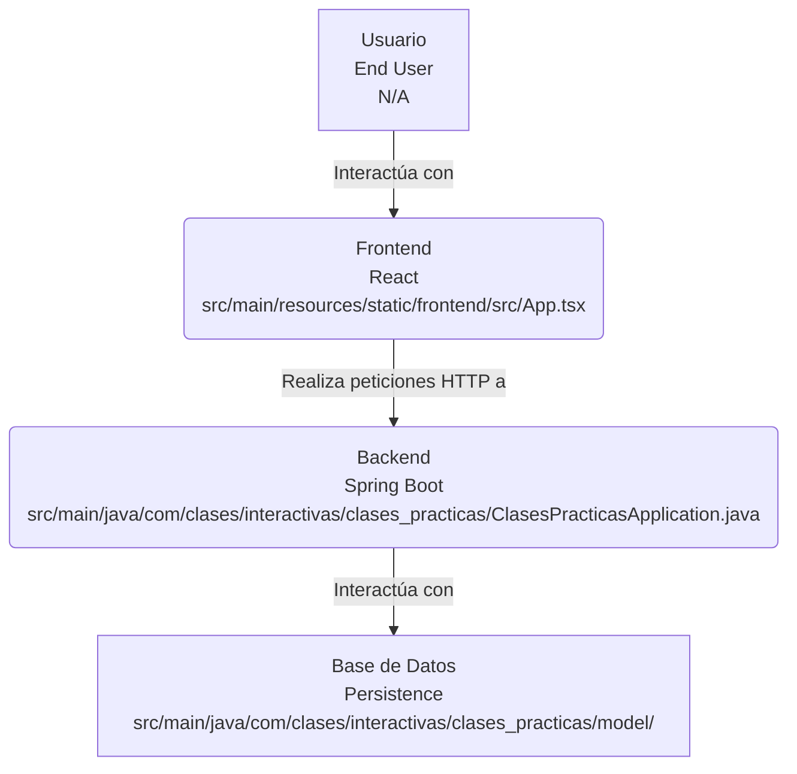
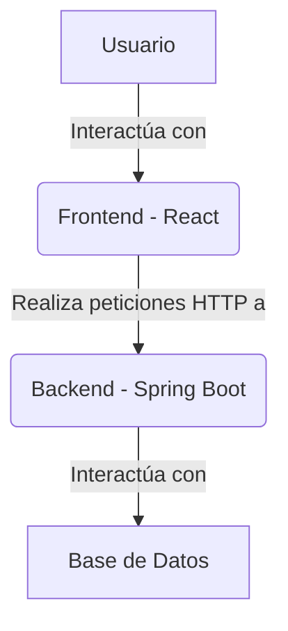
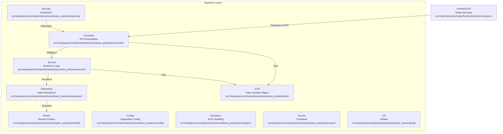
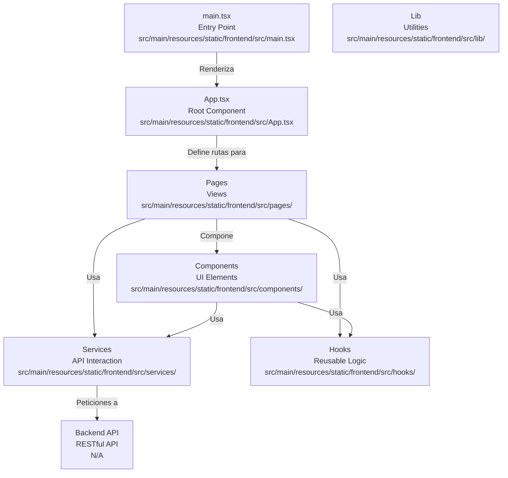
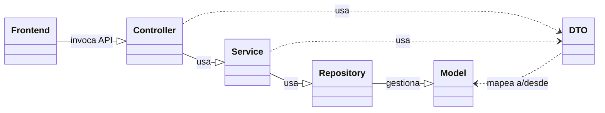
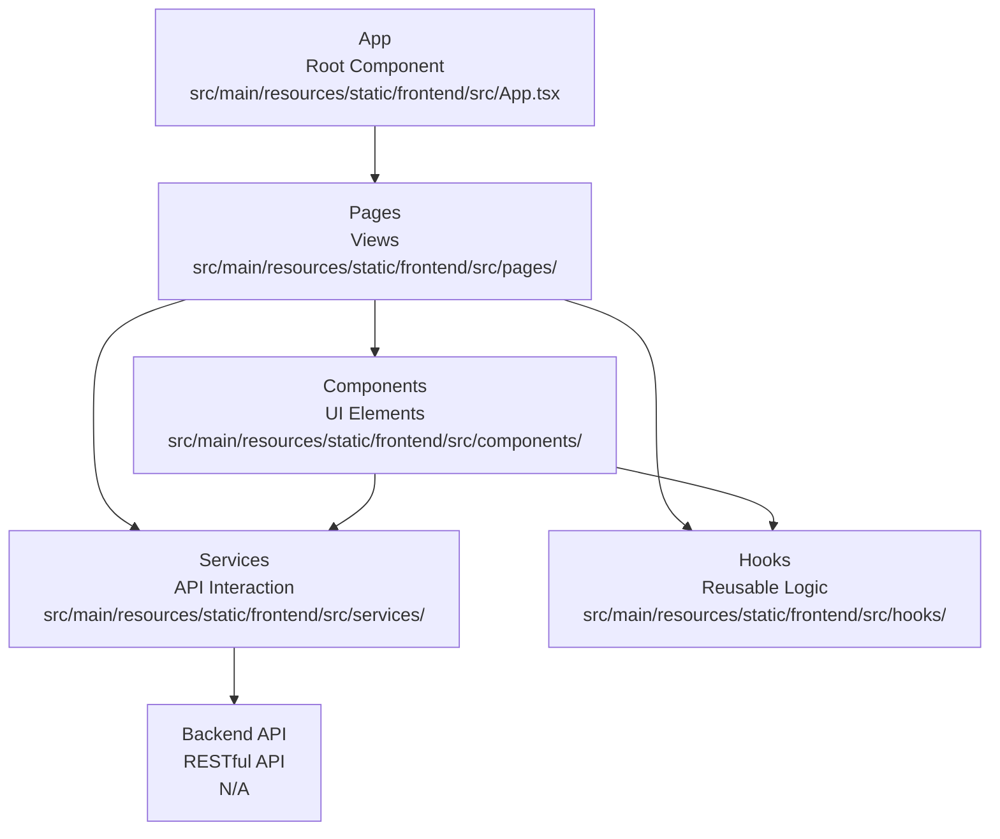
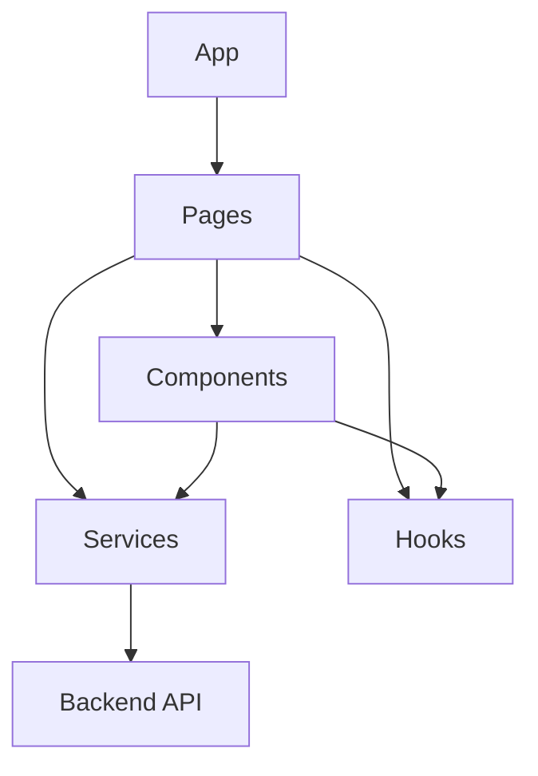

# Codebase Research Report

## Query
crear diagramas uml 

## Answer
# Arquitectura de la Aplicación

La aplicación `clases-practicas` es una aplicación web de pila completa (full-stack) que sigue una arquitectura cliente-servidor. Se compone de un **backend** desarrollado con Spring Boot (Java) que expone una API RESTful, y un **frontend** construido con React (TypeScript) que consume esta API.

## Arquitectura de Alto Nivel




La aplicación se divide en dos componentes principales que interactúan entre sí:

*   **Backend (Servidor)**: Responsable de la lógica de negocio, la persistencia de datos, la seguridad y la exposición de la API.
*   **Frontend (Cliente)**: Responsable de la interfaz de usuario, la interacción con el usuario y el consumo de la API del backend.



### Flujo de Comunicación

1.  El **Usuario** interactúa con la **Interfaz de Usuario** proporcionada por el [Frontend](src/main/resources/static/frontend/src/App.tsx).
2.  El [Frontend](src/main/resources/static/frontend/src/App.tsx) realiza peticiones HTTP (GET, POST, PUT, DELETE) a los endpoints RESTful expuestos por el [Backend](src/main/java/com/clases/interactivas/clases_practicas/ClasesPracticasApplication.java).
3.  El [Backend](src/main/java/com/clases/interactivas/clases_practicas/ClasesPracticasApplication.java) procesa las peticiones, aplica la lógica de negocio, interactúa con la [Base de Datos](src/main/java/com/clases/interactivas/clases_practicas/model/) y devuelve una respuesta al [Frontend](src/main/resources/static/frontend/src/App.tsx).
4.  El [Frontend](src/main/resources/static/frontend/src/App.tsx) renderiza la respuesta y actualiza la interfaz de usuario.

## Componentes del Backend (Spring Boot)




El backend está estructurado en capas, siguiendo principios de diseño comunes en aplicaciones Spring Boot. El punto de entrada principal es [ClasesPracticasApplication.java](src/main/java/com/clases/interactivas/clases_practicas/ClasesPracticasApplication.java).

### Capas y sus Responsabilidades

*   **`controller/`**:
    *   **Propósito**: Maneja las peticiones HTTP entrantes y devuelve respuestas HTTP. Actúa como la capa de presentación de la API REST.
    *   **Partes Internas**: Contiene clases anotadas con `@RestController` que definen los endpoints de la API.
    *   **Relaciones Externas**: Recibe peticiones del [Frontend](src/main/resources/static/frontend/src/services/api.ts) y delega la lógica de negocio a la capa de [Service](src/main/java/com/clases/interactivas/clases_practicas/service/). Utiliza [DTOs](src/main/java/com/clases/interactivas/clases_practicas/dto/) para la comunicación de datos.

*   **`service/`**:
    *   **Propósito**: Contiene la lógica de negocio principal de la aplicación. Orquesta las operaciones entre los controladores y los repositorios.
    *   **Partes Internas**: Clases anotadas con `@Service` que implementan la lógica de negocio.
    *   **Relaciones Externas**: Es invocado por los [Controllers](src/main/java/com/clases/interactivas/clases_practicas/controller/) y utiliza los [Repositories](src/main/java/com/clases/interactivas/clases_practicas/repository/) para interactuar con la base de datos.

*   **`repository/`**:
    *   **Propósito**: Proporciona una abstracción para la capa de persistencia de datos. Realiza operaciones CRUD (Crear, Leer, Actualizar, Eliminar) sobre las entidades del modelo.
    *   **Partes Internas**: Interfaces que extienden `JpaRepository` (o similar) para las entidades del [Modelo](src/main/java/com/clases/interactivas/clases_practicas/model/).
    *   **Relaciones Externas**: Es utilizado por la capa de [Service](src/main/java/com/clases/interactivas/clases_practicas/service/) para acceder a la base de datos.

*   **`model/`**:
    *   **Propósito**: Define las entidades de dominio de la aplicación, que generalmente se mapean a tablas en la base de datos.
    *   **Partes Internas**: Clases Java que representan las estructuras de datos principales, anotadas con `@Entity`.
    *   **Relaciones Externas**: Son gestionadas por los [Repositories](src/main/java/com/clases/interactivas/clases_practicas/repository/) y utilizadas por las capas de [Service](src/main/java/com/clases/interactivas/clases_practicas/service/) y [Controller](src/main/java/com/clases/interactivas/clases_practicas/controller/) (a menudo a través de [DTOs](src/main/java/com/clases/interactivas/clases_practicas/dto/)).

*   **`dto/`**:
    *   **Propósito**: Data Transfer Objects. Clases simples utilizadas para transferir datos entre diferentes capas de la aplicación o entre el backend y el frontend, desacoplando el modelo de dominio de la API.
    *   **Partes Internas**: Clases Java con atributos y métodos getter/setter.
    *   **Relaciones Externas**: Utilizados por [Controllers](src/main/java/com/clases/interactivas/clases_practicas/controller/) y [Services](src/main/java/com/clases/interactivas/clases_practicas/service/).

*   **`security/`**:
    *   **Propósito**: Configura y gestiona la autenticación y autorización de los usuarios.
    *   **Partes Internas**: Clases de configuración de seguridad (e.g., `WebSecurityConfig`), filtros, proveedores de autenticación.
    *   **Relaciones Externas**: Intercepta las peticiones HTTP antes de que lleguen a los [Controllers](src/main/java/com/clases/interactivas/clases_practicas/controller/).

*   **`config/`**:
    *   **Propósito**: Contiene clases de configuración para la aplicación, como la configuración de la base de datos, la seguridad, etc.
    *   **Partes Internas**: Clases anotadas con `@Configuration`.
    *   **Relaciones Externas**: Son leídas por el framework Spring para configurar el comportamiento de la aplicación.

*   **`exception/`**:
    *   **Propósito**: Define excepciones personalizadas y manejadores de excepciones globales para la aplicación.
    *   **Partes Internas**: Clases que extienden `RuntimeException` o `Exception`, y clases anotadas con `@ControllerAdvice` o `@RestControllerAdvice`.
    *   **Relaciones Externas**: Son lanzadas por las capas de [Service](src/main/java/com/clases/interactivas/clases_practicas/service/) o [Controller](src/main/java/com/clases/interactivas/clases_practicas/controller/) y capturadas por los manejadores de excepciones.

*   **`enums/`**:
    *   **Propósito**: Define tipos enumerados utilizados en la aplicación para representar un conjunto fijo de constantes.
    *   **Partes Internas**: Clases `enum`.
    *   **Relaciones Externas**: Utilizados por cualquier capa que necesite un conjunto predefinido de valores.

*   **`util/`**:
    *   **Propósito**: Contiene clases de utilidad generales que proporcionan funciones auxiliares que pueden ser usadas en varias partes de la aplicación.
    *   **Partes Internas**: Clases con métodos estáticos o de instancia para tareas comunes.
    *   **Relaciones Externas**: Son invocados por otras capas según sea necesario.

## Componentes del Frontend (React)




El frontend es una aplicación React que se encuentra en [src/main/resources/static/frontend/](src/main/resources/static/frontend/). El punto de entrada principal es [main.tsx](src/main/resources/static/frontend/src/main.tsx), que renderiza el componente [App.tsx](src/main/resources/static/frontend/src/App.tsx).

### Estructura y Responsabilidades

*   **`src/main.tsx`**:
    *   **Propósito**: El punto de entrada principal de la aplicación React. Inicializa la aplicación y renderiza el componente raíz.
    *   **Partes Internas**: Contiene la lógica para montar el componente [App.tsx](src/main/resources/static/frontend/src/App.tsx) en el DOM.
    *   **Relaciones Externas**: Es el primer archivo ejecutado por el navegador.

*   **`src/App.tsx`**:
    *   **Propósito**: El componente raíz de la aplicación. Generalmente contiene la configuración de enrutamiento y la estructura de diseño global.
    *   **Partes Internas**: Define las rutas de la aplicación y renderiza los componentes de [Páginas](src/main/resources/static/frontend/src/pages/) según la URL.
    *   **Relaciones Externas**: Contiene y orquesta los componentes de [Páginas](src/main/resources/static/frontend/src/pages/) y [Componentes](src/main/resources/static/frontend/src/components/).

*   **`src/pages/`**:
    *   **Propósito**: Contiene los componentes de nivel superior que representan las diferentes vistas o "páginas" de la aplicación (e.g., [Login.tsx](src/main/resources/static/frontend/src/pages/Login.tsx), [AdminDashboard.tsx](src/main/resources/static/frontend/src/pages/AdminDashboard.tsx), [StudentDashboard.tsx](src/main/resources/static/frontend/src/pages/StudentDashboard.tsx)).
    *   **Partes Internas**: Cada archivo es un componente React que compone otros [Componentes](src/main/resources/static/frontend/src/components/) y utiliza [Servicios](src/main/resources/static/frontend/src/services/) para interactuar con el backend.
    *   **Relaciones Externas**: Son renderizados por el componente [App.tsx](src/main/resources/static/frontend/src/App.tsx) a través del enrutamiento.

*   **`src/components/`**:
    *   **Propósito**: Contiene componentes de interfaz de usuario reutilizables y más pequeños (e.g., [Navigation.tsx](src/main/resources/static/frontend/src/components/Navigation.tsx), [Footer.tsx](src/main/resources/static/frontend/src/components/Footer.tsx), [SubmitAssignmentModal.tsx](src/main/resources/static/frontend/src/components/SubmitAssignmentModal.tsx)).
    *   **Partes Internas**: Cada archivo es un componente React que encapsula una parte específica de la UI.
    *   **Relaciones Externas**: Son utilizados por los componentes de [Páginas](src/main/resources/static/frontend/src/pages/) o por otros componentes.

*   **`src/services/`**:
    *   **Propósito**: Contiene la lógica para interactuar con la API RESTful del backend.
    *   **Partes Internas**: Archivos como [api.ts](src/main/resources/static/frontend/src/services/api.ts) (configuración de Axios), [authService.ts](src/main/resources/static/frontend/src/services/authService.ts) (lógica de autenticación), [userService.ts](src/main/resources/static/frontend/src/services/userService.ts) (operaciones de usuario).
    *   **Relaciones Externas**: Realizan peticiones HTTP al [Backend](src/main/java/com/clases/interactivas/clases_practicas/controller/) y son utilizados por los componentes de [Páginas](src/main/resources/static/frontend/src/pages/) o [Componentes](src/main/resources/static/frontend/src/components/) que necesitan datos del servidor.

*   **`src/hooks/`**:
    *   **Propósito**: Contiene hooks personalizados de React para encapsular lógica reutilizable y con estado.
    *   **Partes Internas**: Archivos como [useAuth.tsx](src/main/resources/static/frontend/src/hooks/useAuth.tsx) (lógica de autenticación), [use-mobile.tsx](src/main/resources/static/frontend/src/hooks/use-mobile.tsx).
    *   **Relaciones Externas**: Son utilizados por los componentes de [Páginas](src/main/resources/static/frontend/src/pages/) o [Componentes](src/main/resources/static/frontend/src/components/).

*   **`src/lib/`**:
    *   **Propósito**: Contiene funciones de utilidad generales que no están directamente relacionadas con la UI o la lógica de negocio específica de un componente.
    *   **Partes Internas**: Archivos como [utils.ts](src/main/resources/static/frontend/src/lib/utils.ts).
    *   **Relaciones Externas**: Son importados y utilizados por cualquier componente o servicio que los necesite.

## Diagrama de Clases (Ejemplo - Backend)

```mermaid
graph TB
    classDiagram
        direction LR
        Controller["Controller<br>API Layer<br>src/main/java/com/clases/interactivas/clases_practicas/controller/"] --|> Service["Service<br>Business Logic<br>src/main/java/com/clases/interactivas/clases_practicas/service/"] : usa
        Service --|> Repository["Repository<br>Data Access<br>src/main/java/com/clases/interactivas/clases_practicas/repository/"] : usa
        Repository --|> Model["Model<br>Domain Entities<br>src/main/java/com/clases/interactivas/clases_practicas/model/"] : gestiona
        Controller ..> DTO["DTO<br>Data Transfer<br>src/main/java/com/clases/interactivas/clases_practicas/dto/"] : usa
        Service ..> DTO : usa
        Frontend["Frontend<br>React App<br>src/main/resources/static/frontend/"] --|> Controller : invoca API
        Model <.. DTO : mapea a/desde
```


Para un diagrama de clases más detallado, se necesitaría analizar el contenido específico de cada archivo en las carpetas `model`, `repository`, `service`, y `controller`. Sin embargo, a modo de ejemplo conceptual, se podría visualizar la interacción entre las capas:



## Diagrama de Componentes (Ejemplo - Frontend)




De manera similar, para el frontend, un diagrama de componentes podría mostrar:



---
*Generated by [CodeViz.ai](https://codeviz.ai) on 7/9/2025, 12:25:11 AM*
